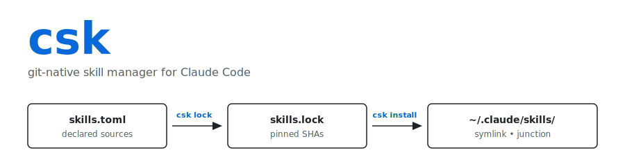

<p align="center">
  <picture>
    <source media="(prefers-color-scheme: dark)" srcset="docs/header-dark.svg">
    
  </picture>
</p>

<p align="center">
  <a href="https://github.com/pformoso-deus-ai/csk/actions/workflows/ci.yml"></a>
  <a href="LICENSE"></a>
  
</p>

---

## Why this exists

Claude Code has two ways to load a skill:

- **Plugins** — distributed through the marketplace, with `claude plugin install` and update tooling.
- **Personal skills** — loose files in `~/.claude/skills/<name>/` or `.claude/skills/<name>/`.

Plugins have a distribution story. **Personal skills don't.** If you develop a skill in its own git repo today, the workflow is: clone it manually, copy or symlink into `~/.claude/skills/`, remember to `git pull` later. There is no lockfile, no manifest, no way to declare a reproducible set of skills, no way to share that set across machines or with a teammate.

`csk` fills exactly that gap. It is to skills what `cargo` and `uv` are to libraries: a declarative manifest, a pinned lockfile, and a reproducible `csk install` on any machine. It does **not** replace the plugin system — plugins keep their existing distribution story — `csk` is for the personal-skill side of the line.

What you get:

- **Declare** your skills in `skills.toml`. One TOML key per skill, with a git URL and an optional ref / subdir.
- **Pin** to a commit SHA in `skills.lock`. Commit the lockfile to your dotfiles or project repo.
- **Reproduce** on any machine with `csk install`. Cache + symlinks/junctions get rebuilt to match the lockfile.
- **Adopt** the skills you've already hand-installed without losing local data.

Zero coupling to Claude Code itself: `csk` writes to the same `~/.claude/skills/` paths Claude already reads. Claude Code needs no awareness of `csk`.

## Quickstart

```sh
# One-time: stand up the global scope
csk init

# Add a skill from any git URL — clones, resolves ref → SHA, writes manifest + lockfile,
# creates the junction Claude Code reads.
csk add https://github.com/pformoso-deus-ai/handoff-claude-skill.git

# Inspect what's installed
csk list

# Commit ~/.claude/skills.toml and ~/.claude/skills.lock to your dotfiles.
# On a fresh machine after cloning your dotfiles:
csk install   # reproduces the exact same skill set
```

For a per-project skill set, run the same commands from inside the project. `csk` auto-detects scope based on whether `./.claude/skills.toml` exists; `--global` / `--project` force.

## Concept

```
# Global scope
~/.claude/skills.toml              # manifest — you edit this
~/.claude/skills.lock              # lockfile — csk writes this; commit to your dotfiles
~/.claude/skills-cache/<name>/     # full git clone — source of truth
~/.claude/skills/<name>            # symlink / junction → ../skills-cache/<name>/[subdir]

# Project scope mirrors the same layout under <project>/.claude/
```

`skills-cache/` is the source of truth for installed bits; `skills/` is just the surface Claude Code reads. The split lets you `git pull` directly inside a cache entry while developing, or let `csk` manage it.

## Commands

| Command | What it does |
|---|---|
| `csk init` | Create empty manifest + lockfile in the current scope |
| `csk add <git-url>` | Clone, resolve ref → SHA, write manifest + lockfile, create the junction |
| `csk remove <name>` | Drop manifest + lockfile entries, remove junction, optional `--prune` of the cache |
| `csk install` | Reconcile cache + junctions to match the lockfile (idempotent) |
| `csk sync` | Alias for `install` |
| `csk update [name ...]` | Re-resolve refs to fresh SHAs, update lockfile, sync cache. No args = update all |
| `csk lock` | Re-resolve the manifest, rewrite the lockfile from scratch, no install side effect |
| `csk list` | Tabular view of every skill with state: `clean` / `drifted` / `missing` / `unlinked` / `manifest-only` / `lock-only` |
| `csk adopt <name> --source URL` | Register a hand-installed skill: byte-diff existing dir against the source, swap to junction on match |
| `csk doctor` | Read-only diagnosis of cache / junction / manifest / lockfile drift |
| `csk upgrade` | Replace the csk binary itself with the latest GitHub release. `--check` only previews. |

Run any command with `--help` for its full flag surface.

## Manifest (`skills.toml`)

```toml
version = 1

[skills.handoff]
source = "https://github.com/pformoso-deus-ai/handoff-claude-skill.git"
ref = "main"                       # branch, tag, or commit. Default: "main".
# subdir = "packages/handoff"      # optional, for monorepos.
```

Minimum required field per skill: `source`. The TOML key is the local install name (also the junction name).

## Lockfile (`skills.lock`)

Tool-managed. One `[[skill]]` block per entry, with `commit = "<full SHA>"`. OS-independent — junction-vs-symlink is decided at install time, never stored. Commit it across machines.

```toml
version = 1
generated = "2026-05-21T09:34:00Z"

[[skill]]
name = "handoff"
source = "https://github.com/pformoso-deus-ai/handoff-claude-skill.git"
ref = "main"
commit = "a1b2c3d4e5f6789abcdef..."
subdir = ""
```

## Workflows

### Dotfiles-style sharing

```sh
csk init
csk add https://github.com/pformoso-deus-ai/handoff-claude-skill.git
csk add https://github.com/pablo/codegraph-skill.git
# commit ~/.claude/skills.toml and ~/.claude/skills.lock to your dotfiles
```

On a fresh machine: `git clone <dotfiles> ~/dotfiles && cp ~/dotfiles/.claude/skills.{toml,lock} ~/.claude/ && csk install` — same skill set, same pinned commits.

### Per-project skill set

```sh
cd ~/work/my-project
csk init --project       # writes ./.claude/skills.toml
csk add https://github.com/team/project-skill.git
git add .claude/skills.toml .claude/skills.lock
```

Teammates clone the project and `csk install` to get the project's skills set up.

### Adopting a hand-installed skill

```sh
# You already have ~/.claude/skills/handoff/ from a previous manual clone.
csk init
csk adopt handoff --source https://github.com/pformoso-deus-ai/handoff-claude-skill.git
# csk byte-diffs your local content against the source. If they match, your
# directory is replaced with a junction into the csk-managed cache and the
# skill is registered. If they diverge, csk lists the differences and
# refuses unless you pass --force --yes.
```

### Updating a skill

```sh
csk update handoff             # one skill
csk update                     # all skills in the manifest
```

For each target, `csk update` re-resolves the manifest ref to the latest commit on that ref, updates the lockfile, and checks out the new commit in the cache. The junction repoints automatically.

## Building from source

You need Go 1.23+ and `git` on `PATH`.

```sh
go build -o csk ./cmd/csk
./csk --help
```

Cross-compile:

```sh
GOOS=windows GOARCH=amd64 go build -o csk.exe ./cmd/csk
GOOS=darwin  GOARCH=arm64 go build -o csk     ./cmd/csk
GOOS=linux   GOARCH=amd64 go build -o csk     ./cmd/csk
```

## Platform notes

- **Linux / macOS**: skills are exposed as symlinks.
- **Windows**: skills are exposed as directory junctions (`mklink /J`). No admin or developer-mode required — junctions don't need either.

Decided automatically at install time. The lockfile itself is OS-independent (URLs + SHAs only).

## Design

See [`SPEC.md`](SPEC.md) for the full design document — goals, non-goals, command behavior, edge cases, and the v1 implementation decisions that fleshed out the spec during build.

## License

MIT — see [LICENSE](LICENSE).
